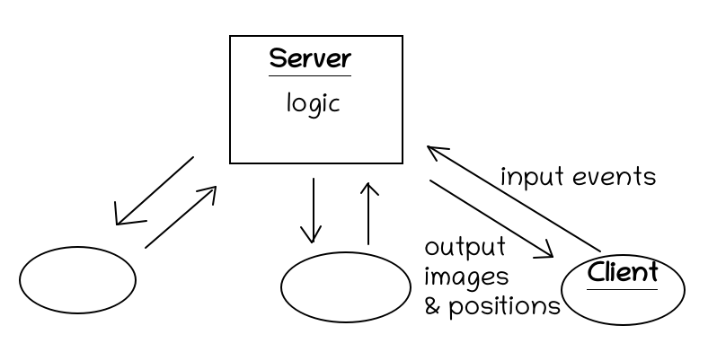

# Caligine

A declarative, multiplayer game engine, with a simple programming interface.

# Multiplayer

It's a client-server architecture. When you run a script, you also spin up an application server. A caligine-lang script allows you to declare named client objects. A client connects to the server specifying their name, and they are assigned an avatar accoriding to the script.

Under the hood, the client and server use websockets to communicate, for speed.

The client is responsible for sending events to the server (e.g. key presses) which are processed by the server. The server then produces the updated positions of the sprites and sends them back to the client, who simply redraws them on a canvas.

# Caligine Lang

The DSL (Domain Specific Language) developed for Caligine.

- 
- 
- 

# Competitors

- https://www.construct.net/en

